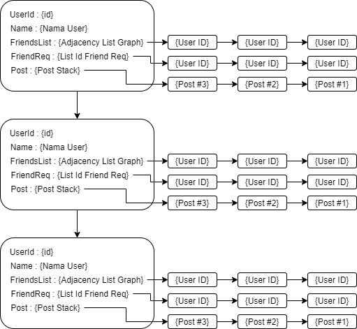
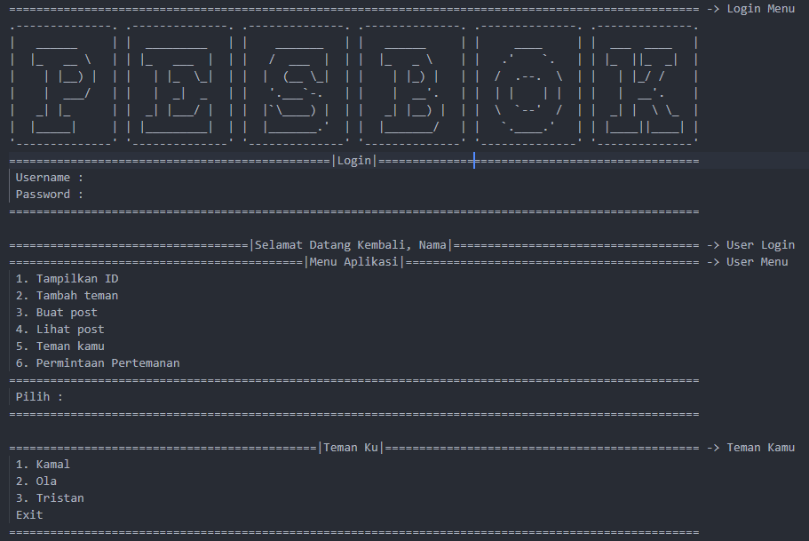
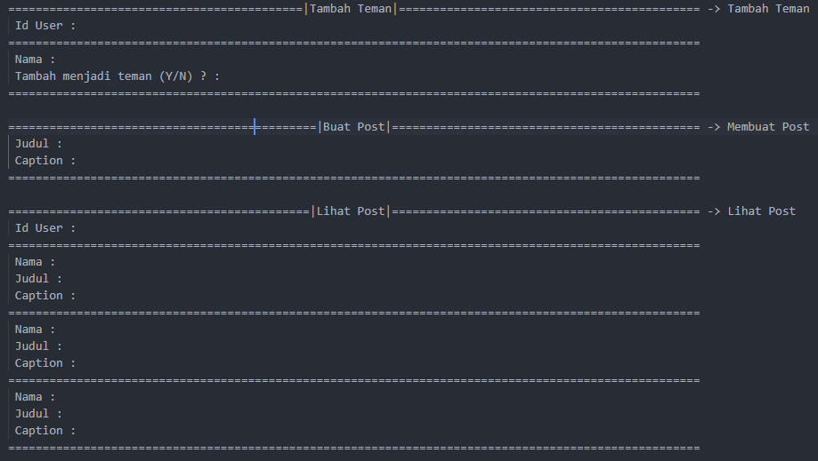
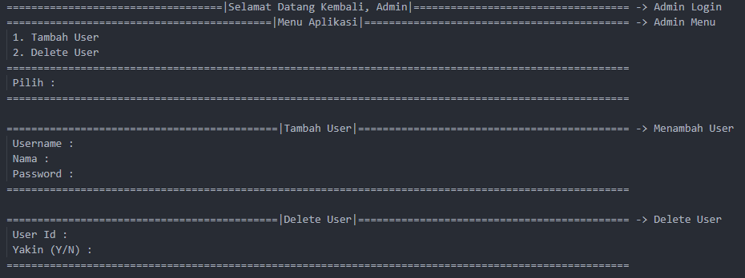

# SOSMED_PROJEK

Anggota Kelompok:
* Irfan Kamal (140810200032)
* Amariel Danendra Dagna (140810200058)
* Satriyatama Tristan Suharjono (140810200068)
---

## Latar Belakang
Social media adalah sebuah media daring yang digunakan satu sama lain yang para penggunanya bisa dengan mudah berpartisipasi, berinteraksi, berbagi, dan menciptakan isi blog, jejaring sosial, wiki, forum dan dunia virtual tanpa dibatasi oleh ruang dan waktu. Social media adalah satu hal yang tidak bisa lepas dari manusia. Dari kalangan anak muda sampai orang tua memakainya untuk keperluan komunikasi sehari-hari. 

Salah satu contoh social media yang paling sering digunakan oleh masyarakat adalah twitter. Twitter termasuk dalam sepuluh situs yang paling sering dikunjungi di Internet dan dijuluki dengan "pesan singkat dari Internet". Twitter memungkinkan penggunanya untuk mengririm dan membaca pesan yang ditulis oleh pengguna lain. Layanan jejaring sosial ini menggunakan fitur add friend dan mem-posting suatu kalimat, foto, dan video.

Kelompok kami membuat aplikasi social media sederhana yang terinspirasi dari social media twitter. Program yang kami buat menggunakan beberapa materi praktikum struktur data yang sudah kami pelajari, yaitu graph, stack, dan linked list.

## Tujuan dan Manfaat
Tujuan kami membuat program aplikasi social media sederhana ini sebagai perwujudan dari humane tech yang mana membuat aplikasi tetapi juga memikirkan faktor manusianya. Manfaat dibuatnya program ini adalah untuk membuat sosial media yang bisa membuat penggunanya tetap up to date, tetapi juga tidak membuat pengguna menjadi terdistraksi ataupun kecanduan.

## Penjelasan Aplikasi
Aplikasi Sosmed kami merupakan aplikasi yang dibuat dengan bahasa c++ dan UI CLI. Aplikasi ini akan memiliki beberapa fitur seperti fitur pertemanan dan post. Dengan struktur data sebagai berikut.

Fungsi yang akan dimiliki oleh aplikasi ini seperti menambah user, delete user, menambahkan teman, menerima request teman, membuat post, melihat post.
## Gambar Rancangan Antar Muka
<!--
Buat rancangan antar muka selengkap mungkin sesuai fungsi aplikasinya. rancangan antar muka
diusahakan serapih dan seindah mungkin. tools yang digunakan dalam pembuatan rancangan gambar
dibebaskan sesuai kreatifitas kalian
!-->
Untuk rancangan antar muka dari aplikasi kami sebagai berikut :

## Rencana Pengerjaan Projek
<!--
Dalam kondisi pandemi seperti ini, tidak memungkinkan untuk bertemu bertatap muka. Maka dari itu
jelaskan bagaimana kalian bekerja sama, berkoordinasi, pembagian kerja.Tools apa yang kalian gunakan
untuk bekerja bersama sama cth github, google docs, google meet>ibebaskan sesuai kreatifitas kalian
!-->
Untuk Pengerjaan Projek ini kami akan menggunakan beberapa aplikasi untuk melakukan kolaborasi dua arah, diantaranya:

<ul>
    <li>Github</li>
    <li>Google Docs</li>
    <li>Line</li>
    <li>Google Meet</li>
</ul>

Pembagian tugas kami yaitu dengan membagi fungsi-fungsinya ke masing masing anggota yang akan dibagi nantinya.
## Lisensi

MIT License 2021
